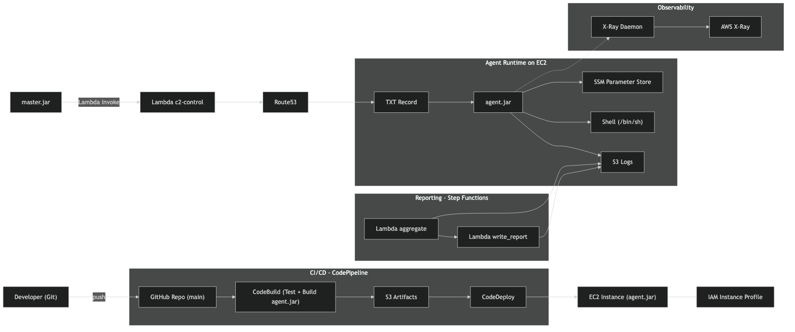
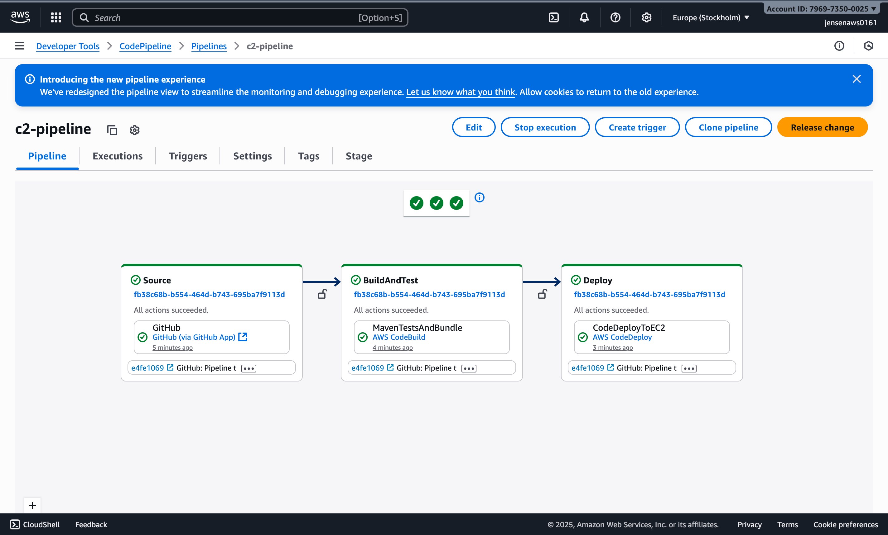
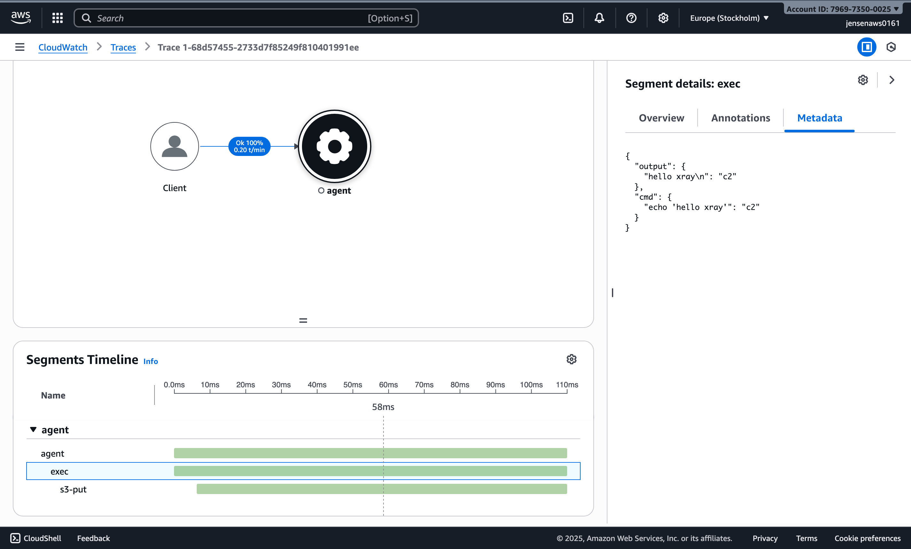
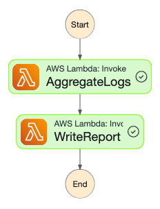

# DNS-baserat C2 på AWS


## Innehållsförteckning
1. [Kort sammanfattning och syfte](#kort-sammanfattning-och-syfte)
2. [Arkitekturskiss](#arkitekturskiss)
3. [IAM-roller & policys](#iam-roller--policys)
4. [SDK-exempel](#sdk-exempel)
5. [CI/CD](#cicd)
6. [X-Ray](#x-ray)
7. [Step Functions](#step-functions)
8. [Övervakning och underhåll (VG)](#övervakning-och-underhåll-vg)

---

## Kort sammanfattning och syfte
Det här projektet är ett Command & Control (C2)-system byggt i en labbmiljö på AWS. De tre AWS-tjänsterna jag valt är Systems Manager, S3 och Route 53.

En central **Mästar**-applikation styr en **Agent** (installerad på en EC2-instans) via DNS-baserad kommunikation.

Syftet med detta projekt är att ge en praktisk inblick i hur DNS-baserade C2-kanaler fungerar och kan missbrukas i cyberattacker.  

---

## **Vad är ett C2?**

C2 (**Command & Control**) används i säkerhetsvärlden för att styra övertagna system:

- Skicka instruktioner till en infekterad maskin.
- Ta emot resultat tillbaka.

## **Varför DNS?**

- **Ser ut som vanlig trafik** - DNS används i nästan alla miljöer.
- **Bypass av brandväggar** - DNS är nästan alltid öppet.
- **Enkel polling** - Agenter kan hämta TXT-records utan långlivade anslutningar.

---

## Arkitekturskiss
  

---

## IAM-roller & policys

Följer principen om minsta rättigheter:

- [**EC2**](infra/terraform/modules/linux-public/main.tf): `ssm:GetParameter*` (hämta config), `s3:PutObject` (skriva loggar), `route53:ListResourceRecordSets` (läsa TXT-record från AWS under lokal körning, kan tänkas vara onödig), `xray:PutTelemetryRecords & xray:PutTraceSegments` (för AWS X-Ray)
- [**Lambda c2-control**](infra/terraform/modules/lambda-control/main.tf): `route53:ChangeResourceRecordSets` (uppdatera TXT-record)
- [**CodePipeline**](infra/terraform/modules/pipeline/main.tf): åtkomst till artifacts-bucket, starta CodeBuild och trigga CodeDeploy via CodeStar-connection.  
- [**CodeBuild**](infra/terraform/modules/pipeline/main.tf): skriva loggar till CloudWatch och läsa/skriva artifacts i S3.  
- [**CodeDeploy**](infra/terraform/modules/pipeline/main.tf): hämta från artifacts-bucket och deploya till EC2-instanser via taggfilter.

---

## SDK-exempel
Tre AWS SDK-anrop som används i koden:

1. [**S3** - agenten laddar upp loggar](agent/src/main/java/org/linx/Main.java):
   ```java
   // agent/Main.java
   s3.putObject(
          PutObjectRequest.builder()
                  .bucket(bucket)
                  .key(prefix + parsed.id() + ".txt")
                  .build(),
          RequestBody.fromBytes(body.getBytes(StandardCharsets.UTF_8))
   );
   ```

2. [**Lambda** - master sätter kommando via en styr-lambda](lambda-control/src/main/java/org/linx/ControlHandler.java):  
   ```java
   // lambda-control/ControlHandler.java
   ResourceRecordSet rrset = ResourceRecordSet.builder()
                .name(recordName)
                .type(RRType.TXT)
                .ttl(ttl)
                .resourceRecords(ResourceRecord.builder().value(txtValue).build())
                .build();

   ChangeBatch batch = ChangeBatch.builder()
                .changes(Change.builder().action(ChangeAction.UPSERT).resourceRecordSet(rrset).build())
                .build();
   
   ChangeResourceRecordSetsResponse resp =
                r53.changeResourceRecordSets(b -> b.hostedZoneId(zoneId).changeBatch(batch));
   ```

3. [**SSM** - laddar konfiguration:](agent/src/main/java/org/linx/SsmConfig.java)
   ```java
   // agent/SsmConfig.java
   var resp = ssm.getParametersByPath(GetParametersByPathRequest.builder()
                    .path(prefix)
                    .recursive(false)
                    .withDecryption(true)
                    .maxResults(10)
                    .nextToken(token)
                    .build());
   ```

---

## CI/CD
Pipe

1. **Source**  
   GitHub via CodeStar Connections (`main` branch).  

2. **BuildAndTest**  
   CodeBuild kör `mvn test`, packar `agent.jar`.  
   [buildspec.yml](buildspec.yml)

3. **Deploy**  
   - [appspec.yml](appspec.yml) beskriver hur `agent.jar` distribueras till EC2.  
   - Scripts (`scripts/stop_service.sh`, `scripts/start_service.sh`, `scripts/set_perms.sh`, `scripts/health_check.sh`) körs i olika hooks.  
   - Deployment group matchar EC2-instanser baserat på taggar.  
   - Deploy-strategi: **AllAtOnce** (snabbast, men ej zero-downtime).  


---

## X-Ray
Agenten skickar **custom subsegments** för att spåra:
- `exec` (kommando kört, exit-kod, output)
- `s3-put` (uppladdning av logg till S3)


---

## Step Functions
Daglig rapport genereras via ett enkelt arbetsflöde:

1. **AggregateLogs [(Lambda aggregate)](logs-aggregator/lambdas/aggregate.py)** - listar S3-objekt, sammanställer resultat och bygger rapporttext.  
2. **WriteReport [(Lambda write_report)](logs-aggregator/lambdas/write_report.py)** - tar emot rapporttext och skriver `report-YYYY-MM-DD.txt` till S3.

Denna körde jag genom att skapa en ny "execution" i AWS-konsollen med input:
```json
{ 
    "bucket": "c2-logs-597c85",
    "prefix": "logs/",
    "date": "2025-09-23"
}
```


---
Genererad rapport (report-2025-09-23.txt):
```
Report date: 2025-09-23
Total logs: 12
Successes : 12
Failures  : 0

- logs/014703a0-a3eb-4790-acdf-121b9a7f6d18.txt  OK
- logs/2e8e7437-ab9a-4ab8-959e-710710f1ceea.txt  OK
- logs/38642e31-3b20-4a4f-a38c-c7d5304d37fe.txt  OK
- logs/45df84ff-9175-4482-a655-0107c5cd8518.txt  OK
- logs/66a14cdd-9378-49c2-b041-950f3db8a0e1.txt  OK
- logs/7b8164c4-4100-48f0-a112-16491c4d4d7b.txt  OK
- logs/8b2bc50a-2c4a-4dfd-bb46-43ec56791e0a.txt  OK
- logs/97c853bb-3aa8-48d2-a012-e13d0d14b34f.txt  OK
- logs/c6fa65a0-ec2a-4e34-959f-870bb257f71e.txt  OK
- logs/d2f667c5-7478-4343-8e04-ecb75620d62b.txt  OK
- logs/e9d2c979-c63a-4e86-a557-6972230a1c1f.txt  OK
- logs/f9f2270d-84ac-4037-8f79-74a3f56bc15e.txt  OK
```

## Övervakning och underhåll (VG)

### Övervakning
- **CloudWatch Logs & Metrics**: Samla loggar från EC2 och pipelines för att upptäcka fel.
- **AWS X-Ray**: Spåra hur agenten används och identifiera oväntat beteende.
- **CloudWatch Alarms**: Larma på CPU, minne eller fel i loggar (t.ex. misslyckade CodeDeploy-händelser).
- **Step Functions- flödet**: Skapa rapporter regelbundet för att upptäcka misslyckade körningar.

### Underhåll
- **CI/CD Pipeline**: Automatiserade tester och deployment minskar risken för manuella fel och gör uppdateringar enklare.
- **Rollback i CodeDeploy**: Kan aktiveras för att automatiskt rulla tillbaka till senaste fungerande version vid misslyckad deployment.
- **IAM-princip om minsta rättigheter**: Regelbundet se över roller och policies för att minimera risker.
- **Patcha AMI/Packer**: Bygg om AMI:t regelbundet så instansen alltid har senaste uppdateringar.